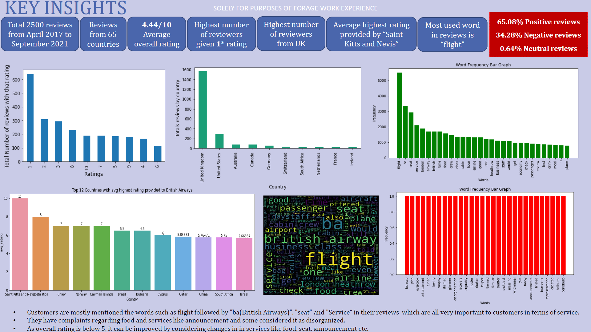
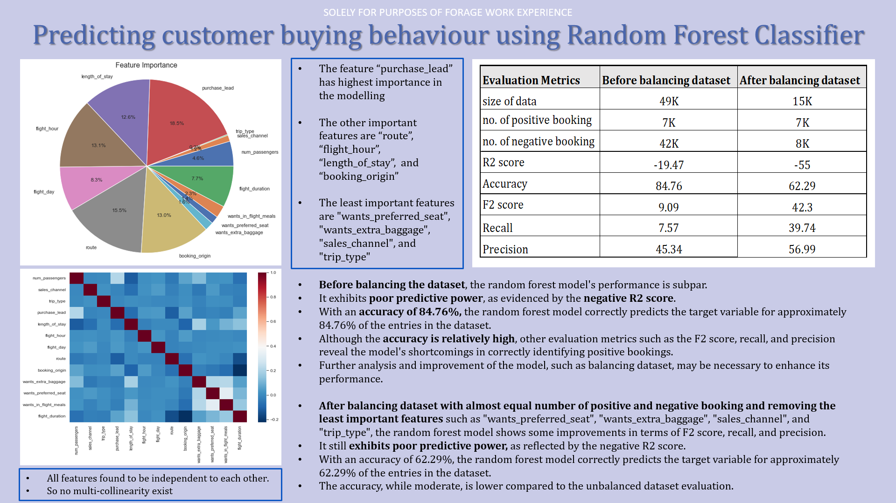

### British Airways Data Science Virtual Internship Programme by Forage
This repository contains solutions to the 2 different tasks that must be performed during the data science virtual internship provided by British Airways via Forage.

# Task 1 
- applying webscraping in unstructured data taken from the https://www.airlinequality.com/airline-reviews/british-airways
- analyze customer reviews using sentimental analysis to sort positive and negative reviews
- preparing a powerpoint representation to highlight our insights and analysis

Following insights were uncovered as they are summed up in the one slide presentation.

--------------------------------------------------------------------------------------------------------------------------------------

# Task 2  
- creating a classification model to predict customer buying behaviour
- preparing a powerpoint representation to highlight our insights and analysis  

Following insights were uncovered as they are summed up in the one slide presentation.  

  

**Program link**: [Forage](https://www.theforage.com/virtual-internships/NjynCWzGSaWXQCxSX?ref=Lgr7NXkrY8gnyBTtu)  
**Completion Certificate link**: [Certificate](https://forage-uploads-prod.s3.amazonaws.com/completion-certificates/British%20Airways/NjynCWzGSaWXQCxSX_British%20Airways_Lgr7NXkrY8gnyBTtu_1684964743393_completion_certificate.pdf)
